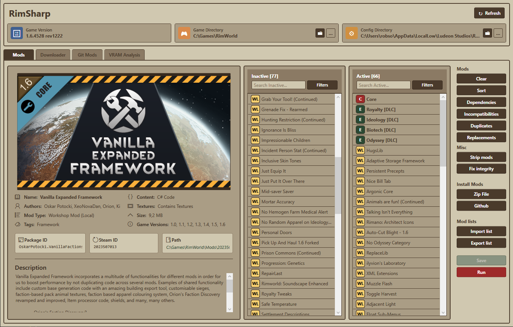

# RimSharp – A Smarter RimWorld Mod Manager

**RimSharp** is a standalone, full-featured mod manager for **RimWorld**, built in C# with WPF. It goes far beyond the built-in manager — giving you better control over mod load order, versioning, dependencies, updates, and even Git integration. Designed for heavy modders, power users, and anyone tired of XML-wrangling and broken save games.

[](https://github.com/robsonswe/RimSharp)  
[](https://github.com/robsonswe/RimSharp#AGPL-3.0-1-ov-file)

---

## Features

### Mod List Management

### Optimization Toolkit

- **Auto-Sorting:** Sorts based on dependencies and rules maintained by the community.
- **Dependency Resolver:** Finds and adds missing mod dependencies.
- **Conflict Detection:** Uses built-in and user rules to flag incompatibilities.
- **Duplicate Mod Detection:** Detects and helps you clean up duplicate mods.
- **Replacement Suggestions:** Detects outdated mods and recommends modern equivalents.
- **Version Awareness:** Combines mod info, known patches, and custom rules to highlight unsupported mods.

### Customization

- Compliment metadata for any mod:
  - Supported game versions
  - External links
  - Custom tags
- Customize rules for load order:
  - `loadBefore`, `loadAfter`, `incompatibleWith`
- Force mods to always load last.

### Workshop Downloads

- **SteamCMD Integration:** Download mods via Steam Workshop.
- **Update Checker:** Compare local mods with Workshop versions.

### Install

- **Local Zips:** Install directly from `.zip` archives.
- **GitHub Integration:** Clone mods directly from GitHub URLs.

### Git Mod Support

- **Git Tab:** Central hub for Git-installed mods.
- **Update Checker:** Detect local changes vs. remote.
- **One-Click Pull:** Sync Git mods easily.

---

## Screenshots



---

## Installation

1. **Download:** Get the latest release from the [Releases page](https://github.com/robsonswe/RimSharp/releases).
2. **Extract:** Unzip it anywhere (e.g. `C:\Games\RimSharp`).
3. **Run:** Start the app via `RimSharp.exe`.
4. **Set Paths:** On first launch, configure your RimWorld installation, Mods folder, and Config folder.

---

## Building from Source

**Prerequisites:**

- [.NET SDK](https://dotnet.microsoft.com/download) (check the project for target version)
- Git

**Steps:**

```bash
git clone https://github.com/robsonswe/RimSharp.git
cd RimSharp
dotnet build RimSharp.sln -c Release
```

Executable will be in `RimSharp.MyApp/bin/Release/netX.Y-windows/`.

You can also build via Visual Studio by opening `RimSharp.sln`.

---

## Usage Overview

- **Set paths first.** RimWorld won’t load mods without the right folders.
- **Use the tabs:**
  - **Mods:** Enable/disable, reorder, troubleshoot, save/load.
  - **Downloader:** SteamCMD-powered Workshop downloader.
  - **Git Mods:** Manage Git-installed mods and updates.
- **Save regularly:** Writes to RimWorld’s `ModsConfig.xml`.

---

## System Requirements

- **OS:** Windows 10 / 11
- **Runtime:** .NET 6/7/8 (depending on your build)
- **RimWorld:** Installed and working copy
- **SteamCMD:** Required for downloading Workshop mods

---

## Contributing

1. Fork the repo.
2. Create a branch:  
   `git checkout -b feature/your-feature`
3. Commit your work:  
   `git commit -am "Add your feature"`
4. Push the branch:  
   `git push origin feature/your-feature`
5. Open a Pull Request.

Stick to the code style. Use comments where appropriate. File issues if you're not sure what’s breaking.

---

## Reporting Issues

Please include:

- How to reproduce it
- What you expected vs. what actually happened
- Screenshots or error messages
- Logs (in RimSharp's folder or `%AppData%`)

Report here: [GitHub Issues](https://github.com/robsonswe/RimSharp/issues)

---

## License

Licensed under [AGPL-3.0](https://github.com/robsonswe/RimSharp#AGPL-3.0-1-ov-file)

---

## Credits

- Ludeon Studios for RimWorld
- Open source libraries like LibGit2Sharp
- Modders keeping the RimWorld ecosystem alive
- [RimPy](https://github.com/rimpy-custom/RimPy) for the UI and features inspiration
